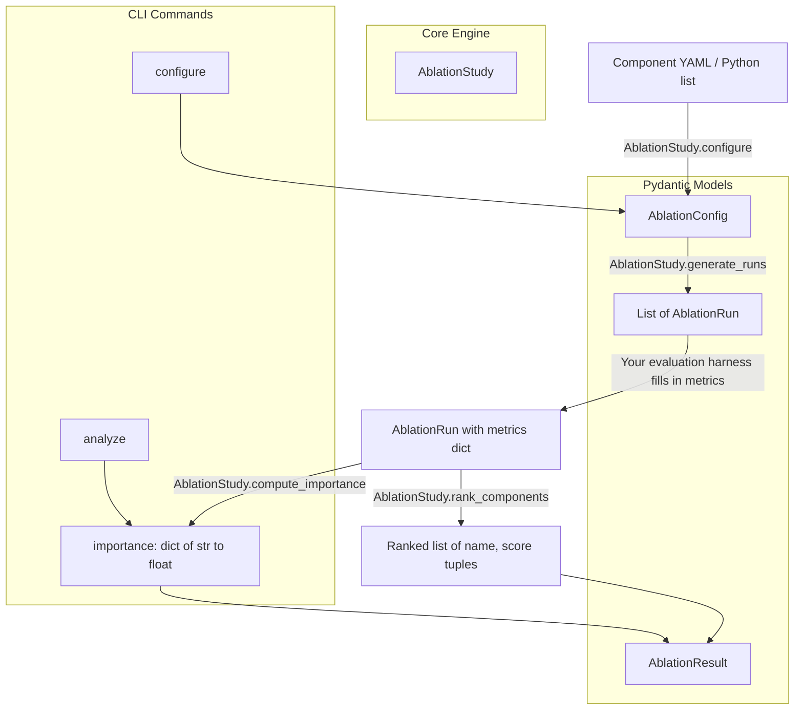

# aumai-ablation

Automated ablation studies for agent components.

[](https://github.com/aumai/aumai-ablation/actions)
[](https://pypi.org/project/aumai-ablation/)
[](LICENSE)
[](https://python.org)

---

## What is this?

Imagine you have built an AI agent that combines five components: a document retriever, a
re-ranker, a query rewriter, a summariser, and an output validator. The system achieves 87%
accuracy on your benchmark. A natural question follows: which of those five pieces actually
matters? If you removed the re-ranker, would accuracy drop by ten points or by zero? Is the
query rewriter earning its computational cost?

That process of switching off one component at a time and measuring what happens is called an
**ablation study**. The term comes from neuroscience, where researchers lesion specific brain
regions and observe changes in behaviour. Ablation studies are standard practice in ML research
papers ("Table 3: Ablations") and increasingly essential in production AI systems.

**aumai-ablation** automates the bookkeeping of ablation studies. It does not run your
evaluations for you — you own the metric collection — but it handles everything else:

- Generating the complete set of runs (baseline plus one run per enabled component)
- Assigning stable, traceable run IDs for every configuration
- Computing per-component importance scores from observed metric deltas
- Ranking components from most to least important, including flagging harmful components

Think of it as the structured spreadsheet manager for your ablation experiment: it tells you
exactly which configurations to run, then turns your filled-in numbers into a ranked report.

---

## Why does this matter?

### The first-principles case for ablation

Every component in a production AI system has a cost: latency, token spend, maintenance burden,
and operational complexity. The only way to justify that cost is evidence that the component
moves the needle on the metrics you care about. Without ablation, teams routinely carry dead
weight in their pipelines — or worse — remove a component that was silently load-bearing.

Ablation studies give you a **data-driven component budget**. They answer:

- "We need to cut p95 latency by 40%. Which components can we safely remove?"
- "We added three new retrieval stages over the last quarter. Which ones are contributing?"
- "The re-ranker costs $0.003 per query at current volume. Does the accuracy gain justify it?"
- "We have a regression in production. Did a recently added component cause it?"

Systematic ablation is how you stop guessing and start measuring.

---

## Architecture



The library is intentionally thin. The core engine is a single class (`AblationStudy`) that
operates purely on Pydantic models. Your evaluation code sits in the middle of the pipeline and
has no coupling to this library at all.

---

## Features

- **One-command study setup** — point the CLI at a YAML file of components, receive a full run plan
- **Deterministic run IDs** — every run gets a UUID-suffixed, human-readable ID for traceability
- **Metric-agnostic** — track any numeric metrics: accuracy, F1, latency, cost, BLEU, etc.
- **Importance scoring** — average metric delta (baseline minus ablated) as the importance signal
- **Component ranking** — sorted descending by importance; negative scores expose harmful components
- **Variance reduction** — configurable `repetitions` count per run
- **CLI workflow** — `configure` generates templates; `analyze` processes completed results
- **Flexible result loading** — accepts both the configure-output JSON and bare JSONL run files
- **Pydantic v2 models** — all data structures validated at runtime with strict typing
- **Zero LLM dependency** — fully deterministic, no API keys, no network calls

---

## Installation

```bash
pip install aumai-ablation

# For YAML support in the CLI (recommended)
pip install "aumai-ablation[yaml]"
# or manually:
pip install aumai-ablation pyyaml
```

---

## Quick Start

### 5-minute Python example

```python
from aumai_ablation import AblationStudy, Component, AblationResult

# 1. Define your components
components = [
    Component(name="retriever", config={"top_k": 5}),
    Component(name="reranker"),
    Component(name="query_rewriter"),
]

# 2. Configure the study
study = AblationStudy()
config = study.configure(
    components=components,
    metrics=["accuracy", "latency_ms"],
)

# 3. Generate run templates (baseline + one per component)
runs = study.generate_runs(config)
print(f"Generated {len(runs)} runs")  # 4 runs

# 4. Fill in metrics from your own evaluation harness
runs[0].metrics = {"accuracy": 0.87, "latency_ms": 320.0}  # baseline
runs[1].metrics = {"accuracy": 0.71, "latency_ms": 210.0}  # retriever ablated
runs[2].metrics = {"accuracy": 0.84, "latency_ms": 290.0}  # reranker ablated
runs[3].metrics = {"accuracy": 0.86, "latency_ms": 300.0}  # query_rewriter ablated

# 5. Rank components by importance
result = AblationResult(config=config, runs=runs)
ranking = study.rank_components(result)

for component_name, importance in ranking:
    print(f"{component_name}: {importance:+.4f}")
# retriever:      +0.1300
# reranker:       +0.0300
# query_rewriter: +0.0050
```

### 5-minute CLI example

```bash
# Step 1: Create a components file
cat > components.yaml << 'EOF'
- name: retriever
  enabled: true
  config:
    top_k: 5
- name: reranker
  enabled: true
- name: query_rewriter
  enabled: true
EOF

# Step 2: Generate the study plan
aumai-ablation configure \
  --components components.yaml \
  --metrics accuracy,latency_ms \
  --output study.json

# Step 3: Edit study.json — fill in "metrics" for each run
# (use your own evaluation framework to produce numbers)

# Step 4: Analyze
aumai-ablation analyze --results study.json
```

---

## CLI Reference

### `aumai-ablation configure`

Generate an ablation study configuration and empty run templates from a components YAML file.

```
Usage: aumai-ablation configure [OPTIONS]

Options:
  --components PATH     Path to a YAML file listing components.  [required]
  --metrics TEXT        Comma-separated metric names, e.g. accuracy,latency_ms.  [required]
  --repetitions INT     Number of repetitions per ablation run.  [default: 1]
  --output PATH         Path to write the config JSON.  [default: ablation_config.json]
  --version             Show version and exit.
  --help                Show this message and exit.
```

**Example:**

```bash
aumai-ablation configure \
  --components components.yaml \
  --metrics accuracy,f1,latency_ms \
  --repetitions 3 \
  --output study.json
```

Output `study.json` has this shape:

```json
{
  "config": {
    "base_components": [...],
    "metrics_to_track": ["accuracy", "f1", "latency_ms"],
    "repetitions": 3
  },
  "runs": [
    {
      "run_id": "baseline-a1b2c3d4",
      "disabled_component": null,
      "components": [...],
      "metrics": {}
    },
    {
      "run_id": "ablate-retriever-e5f6a7b8",
      "disabled_component": "retriever",
      "components": [...],
      "metrics": {}
    }
  ],
  "instructions": "Fill in 'metrics' dict for each run, then use 'analyze' to compute importance."
}
```

Edit the `metrics` dict for each run, then pass the file to `analyze`.

---

### `aumai-ablation analyze`

Compute component importance scores from completed run results.

```
Usage: aumai-ablation analyze [OPTIONS]

Options:
  --results PATH   Path to a JSONL file (one AblationRun per line) or the JSON
                   output from configure.  [required]
  --config PATH    Path to ablation_config.json (if separate from results).
  --output PATH    Optional path to write JSON analysis output.
  --help           Show this message and exit.
```

**Example:**

```bash
# Analyze from the configure output (after filling in metrics)
aumai-ablation analyze --results study.json

# Save to file
aumai-ablation analyze --results study.json --output importance.json

# Use a JSONL file of individual runs
aumai-ablation analyze --results runs.jsonl --config config.json
```

**Sample output:**

```json
{
  "component_importance": {
    "retriever": 0.13,
    "reranker": 0.03,
    "query_rewriter": 0.005
  },
  "ranking": [
    {"component": "retriever", "importance": 0.13},
    {"component": "reranker", "importance": 0.03},
    {"component": "query_rewriter", "importance": 0.005}
  ]
}
```

---

## Python API Examples

### Variance reduction with repetitions

```python
from aumai_ablation import AblationStudy, Component

components = [Component(name="retriever"), Component(name="cache")]
study = AblationStudy()
config = study.configure(components=components, metrics=["accuracy"])
config.repetitions = 5  # Set after configure or pass directly

runs = study.generate_runs(config)
print(f"Generated {len(runs)} runs")       # 3 runs
print(f"Repetitions per run: {config.repetitions}")  # 5
```

### Skipping already-disabled components

If a component has `enabled=False` in your input list, `generate_runs` treats it as already
ablated and will not produce an additional run for it.

```python
from aumai_ablation import AblationStudy, Component

components = [
    Component(name="retriever", enabled=True),
    Component(name="legacy_cache", enabled=False),  # already off — skip
    Component(name="reranker", enabled=True),
]
study = AblationStudy()
config = study.configure(components=components, metrics=["accuracy"])
runs = study.generate_runs(config)
print(len(runs))  # 3: baseline + ablate-retriever + ablate-reranker
```

### Detecting harmful components

A negative importance score means the component is hurting your average metrics — removing it
makes things better.

```python
from aumai_ablation import AblationStudy, Component, AblationResult

components = [Component(name="noisy_filter"), Component(name="core_retriever")]
study = AblationStudy()
config = study.configure(components=components, metrics=["accuracy"])
runs = study.generate_runs(config)

runs[0].metrics = {"accuracy": 0.70}  # baseline with noisy_filter active
runs[1].metrics = {"accuracy": 0.82}  # noisy_filter removed — went UP: it was harmful
runs[2].metrics = {"accuracy": 0.50}  # core_retriever removed — catastrophic drop

result = AblationResult(config=config, runs=runs)
ranking = study.rank_components(result)

for name, score in ranking:
    marker = "HARMFUL — consider removing" if score < 0 else "helpful"
    print(f"  {name}: {score:+.4f}  ({marker})")
# core_retriever: +0.2000  (helpful)
# noisy_filter:   -0.1200  (HARMFUL — consider removing)
```

### Loading CLI results in Python

```python
import json
from aumai_ablation import AblationConfig, AblationResult, AblationRun, AblationStudy

with open("study.json") as f:
    data = json.load(f)

config = AblationConfig.model_validate(data["config"])
runs = [AblationRun.model_validate(r) for r in data["runs"]]

# Fill metrics from your evaluation framework, then analyze
result = AblationResult(config=config, runs=runs)
study = AblationStudy()
ranking = study.rank_components(result)
print(ranking)
```

---

## Configuration Reference

### Component YAML format

```yaml
- name: retriever         # required, 1-128 characters
  enabled: true           # optional, default: true
  config:                 # optional, arbitrary key-value pairs
    top_k: 5
    embedding_model: text-embedding-3-small

- name: reranker
  enabled: true
  config:
    model: cross-encoder/ms-marco-MiniLM-L-6-v2

- name: query_rewriter
  enabled: true
```

### AblationConfig fields

| Field              | Type            | Required | Default | Description                                        |
|--------------------|-----------------|----------|---------|----------------------------------------------------|
| `base_components`  | list[Component] | yes      | —       | Full component set; all should be enabled initially |
| `metrics_to_track` | list[str]       | yes      | —       | Metric names you will populate in each run         |
| `repetitions`      | int (>=1)       | no       | `1`     | Number of evaluation repetitions per run           |

### Component fields

| Field     | Type              | Required | Default | Description                                          |
|-----------|-------------------|----------|---------|------------------------------------------------------|
| `name`    | string (1-128 ch) | yes      | —       | Unique component name; used as the run identifier    |
| `enabled` | bool              | no       | `true`  | Whether this component is active in the baseline     |
| `config`  | dict              | no       | `{}`    | Arbitrary component-specific configuration payload   |

---

## How It Works

### Run generation

`generate_runs` produces `1 + N` runs where `N` is the number of currently-enabled components:

- **Baseline run**: all components deep-copied from the config with their current `enabled`
  state. The `disabled_component` field is `None`. Run ID format: `baseline-<8-hex>`.
- **Ablation run (per enabled component)**: all components deep-copied, then the target
  component is flipped to `enabled=False`. Run ID format: `ablate-<name>-<8-hex>`.

UUID suffixes ensure run IDs are unique across multiple studies.

### Importance scoring

After you populate the `metrics` dict on each run, `compute_importance` calculates:

```
importance(component) = mean(baseline_metrics) - mean(ablated_metrics)
```

All metrics are averaged together. A positive score means removing the component drops your
average — it is helpful. Zero means no measurable effect. Negative means the component is
actively harmful.

### Ranking

`rank_components` calls `compute_importance`, stores the result in
`AblationResult.component_importance`, and returns a list of `(name, score)` tuples sorted
descending by score.

---

## Integration with Other AumAI Projects

| Project             | Integration pattern                                                          |
|---------------------|------------------------------------------------------------------------------|
| **aumai-specs**     | Define evaluation criteria in specs; use them to drive your metric harness   |
| **aumai-eval**      | aumai-eval can produce the metric dicts that fill `AblationRun.metrics`      |
| **aumai-benchmark** | Run benchmarks per ablation configuration; pipe benchmark scores back here   |
| **aumai-agent**     | Define agent sub-components as `Component` objects; ablate your full pipeline |

---

## Contributing

Contributions are welcome. Please follow the AumAI contribution guidelines:

1. Fork the repository and create a feature branch: `feature/<your-feature>`
2. Write tests alongside your implementation (pytest + hypothesis)
3. Ensure `ruff check .` and `mypy --strict .` pass with no errors
4. Submit a pull request explaining _why_ the change is needed

See [CONTRIBUTING.md](CONTRIBUTING.md) for the full guide.

---

## License

Apache License 2.0. See [LICENSE](LICENSE) for details.

---

## Part of AumAI

This project is part of [AumAI](https://github.com/aumai) — open source infrastructure for the
agentic AI era.
